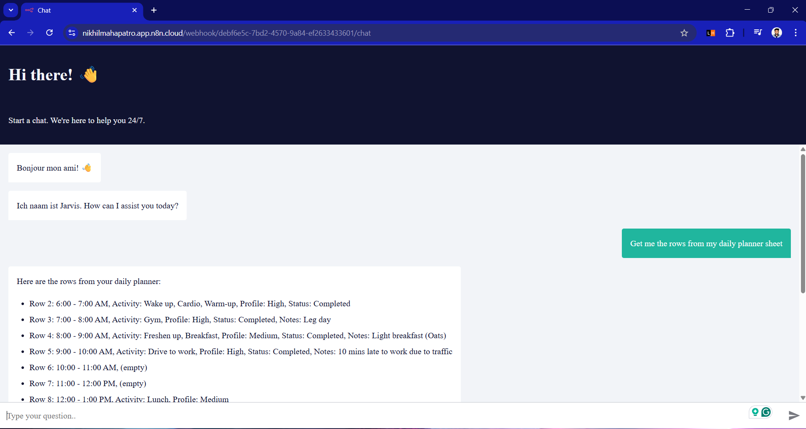

# N8N Daily Planner – AI Workflow Guide

This repo shows how to build an AI-powered Daily Planner using [n8n](https://n8n.io) — the open-source workflow automation tool.

It includes both:
- A **visual walkthrough** with step-by-step screenshots
- An **exported n8n workflow** you can import and run

---

## What This Is

A ready-to-use n8n workflow that:
- Listens for chat input
- Uses an AI model (like Google Gemini) to generate a personalized daily plan
- Sends the result back into your system

---

## 🖼 Demo Preview

Here’s a quick look at what the workflow setup looks like inside n8n:

## Files Included

- `N8N_DailyPlanner.json` – the actual n8n workflow export
- `*.png` screenshots – one per step, showing how the workflow was built and configured

---

## Requirements

- An AI API (e.g., Google Gemini, OpenAI) with a valid API key
- n8n set up and running (self-hosted or cloud)
- Basic understanding of n8n nodes and flows

---

## Why Use This

If you're looking to:
- Automate personal productivity
- Build a smart assistant into your workflows
- Learn how to use AI models inside n8n

…this repo gives you a solid starting point.

---

## 📬 Feedback

Want to improve or extend the workflow? Found a bug? Open an issue or create a pull request.

---

## License

Free to use and remix. Just give credit if you're sharing it elsewhere.
